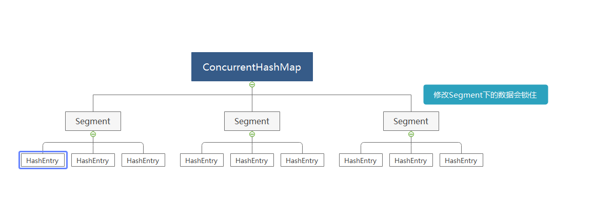
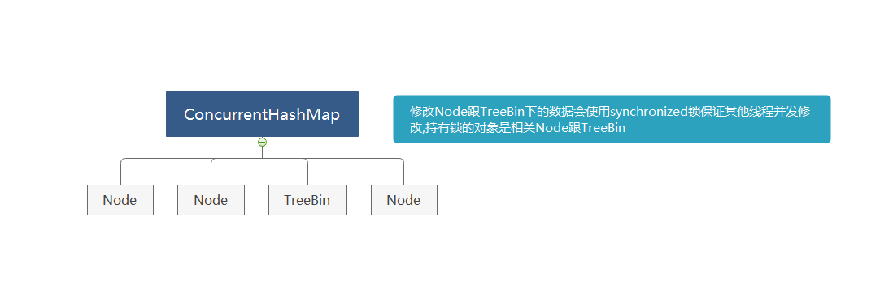
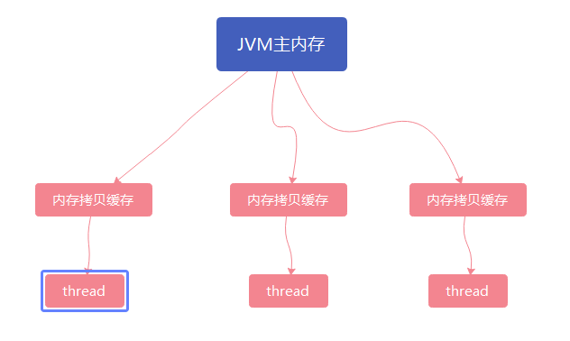

# java基础方面
## 首先还是老生常谈的hashmap。hashmap的set和get的时间复杂度是多少？为什么是O(1), hashmap 在jdk1.8是线程安全的吗？

hashmap的set和get的时间复杂度是o(1), hashmap是jdk对于哈希表算法的一种实现,在set和get的时候会先调用key对象的hashcode()方法生成hashcode,在进行数组长度&hashcode计算所在槽
hash的jdk8版本已经解决了多线程并发访问的resehash造成环形环形链表的问题,但没有解决多线程并发的时候put方法数据丢失的问题(hashmap.node赋值的时候没实现cas)

## 为什么是线程安全的？concureenthashmap了解吗？他是如何实现线程安全的？
concurrenthashmap是jdk对于哈希表线程安全的实现,使用分段锁的概念来避免多线程并发修改哈希表中哈希槽中的数据,赋值的时候实现cas操作保证赋值操作的原子性 
concurrenthashmap在jdk8前后的实现区别很大

jdk1.8之前,在修改segment下的数据的时候,segment会锁住来保证只有当前线程可以修改

jdk1.8之后,currenthashmap放弃了使用ReentrantLock来锁转而使用jdk原生的synchronized来避免并发修改,当某个哈希槽的长度超过阈值(默认8)的时候Node(链表)会转换为TreeBin(红黑树)

## 线程run和start的区别？两次start同一个线程会怎么样？
线程的run方法是定义线程的要做什么事情,start是让线程开始做run方法里的事情;同一个线程两次调用start方法的话JVM会抛出IllegalThreadStateException

## 说一下java的线程模型？说一下violate关键字？他的原理是什么？violate是线程安全的吗？说一下violate和synchronized这两个关键字的区别？
java线程内存模型

保证可见性,被violate修饰的对象在被线程修改的时候会线程会马上将修改结构马上同步到JVM主内存中,被线程访问的时候线程会先从JVM主内存中获取数据并同步到线程中的内存拷贝缓存中  
避免JVM优化代码的指令重排序(优化原则保证happend-before)
violate不是线程安全的,因为violate不能保证多线程的情况下操作的原子性,例如多线程下进行i++  
violate和synchronized都可以避免代码重排序跟多线程对象可见性,synchronized是jvm内置的线程锁保证只有持有锁的线程才能执行某个方法或者代码块,被synchronized修饰的方法跟代码块被编译成字节码的时候,相关字节码的前后会被加上JVM指令monitorEnter跟monitorExit